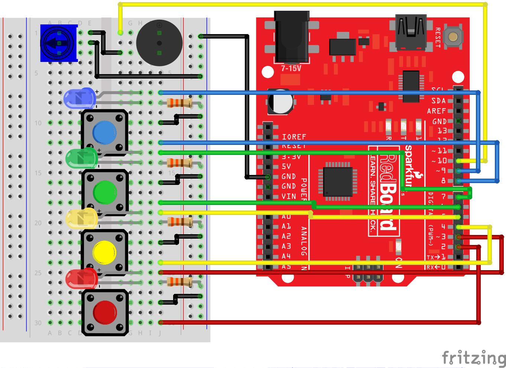
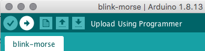

# Simon Says

### Running the Program
The program is compatible with an Arduino Uno board which was set up using a SparkFun Inventor's Kit. Following the instructions, the basic board set up should look like this: 



You will need:


Note that the buzzer is polarized and the positive end should connect to ground (ie. be inserted in row 1).

Arduino and USB drivers will need to be installed for the code to work. Go to www.arduino.cc/downloads to download Arduino and www.sparkfun.com/ch340 to download drivers. Pnce Arduino is installed you will need to select the correct board, in this case: Arduino Uno, and the correct port. Next, connect your board to the computer using an USB cable.

To run the code click on the upload button on the top left corner (second to left) on the arduino interface.



### The Concepts

**For Loops**

For loops repeat a section of code a set number of times using a counter (usually programmers use the letter “i” for this variable) that increases each loop until it reaches a stop value. For example:
```C
for (int i = 0; i < 5; i++){
    Serial.print(i);
}
```
The for loop takes three parameters in the brackets all separated by semicolons. The first parameter is the start value, which in this case is 0. The second value is the stop condition, which in this case, the loop stops when i < 5 is no longer true. The final parameter is an increment value. i++ is shorthand for increase i by 1 each time, but you could also increase i by different amounts. This loop would repeat five times. Each time it would run the code in between the brackets, which prints the value of i to the serial monitor.

**Measuring Durations of Time**

The millis() command counts how many milliseconds have passed since the RedBoard was last powered. Storing the time when an event happens and then subtracting the current time, allows one to measure the number of milliseconds (and thus seconds) that have passed.

### The Program
The program is designed to allow a user to play Simon Says. When the code starts, it flashes all LEDs and plays the start song. After a few seconds, the first light in the pattern will flash. The user must correctly press the corresponding colored button to move on to the next round and add another color to the pattern sequence. If the user makes a mistake, the loss song will play. After 12 rounds, if the user has made no mistakes, the win song will play. To replay, the user must press any button to start a new game.

All melodies are played through the buzzer, and the potentiometer once again controls the volumne of the sound. The closer to the top left the arrow points, the louder the volumne, and the closer to the bottom left, the quieter the volumne.

### The Code
The program begins by setting base line variables for the buttons, LEDS, tones, # of rounds, time limit, etc.
```C
int button[] = {2, 4, 6, 8};  //red is button[0], yellow is button[1], green is button[2], blue is button[3]
int led[] = {3, 5, 7, 9};     //red is led[0], yellow is led[1], green is led[2], blue is led[3]
int tones[] = {262, 330, 392, 494};   //tones to play with each button (c, e, g, b)

int roundsToWin = 12;         //number of rounds the player has to play before they win the game (the array can only hold up to 16 rounds)
int buttonSequence[16];       //make an array of numbers that will be the sequence that the player needs to remember

int buzzerPin = 10;           //pin that the buzzer is connected to

int pressedButton = 4;        //a variable to remember which button is being pressed. 4 is the value if no button is being pressed.
int roundCounter = 1;         //keeps track of what round the player is on


long startTime = 0;           //timer variable for time limit on button press
long timeLimit = 1500;        //time limit to hit a button

boolean gameStarted = false;      //variable to tell the game whether or not to play the start sequence
```

Then the program sets button pins to input_pullup and LED pins to output. The program is called in a loop function that contains basic loops to start game and flash the sequence. It thens calls a for loop where the button pressed and time elapsed are checked. The for loop runs the amount of rounds set:
```C
for (int i = 0; i <= roundCounter; i++)
```
Then the start time is recorded:
```C
startTime = millis();
```
Then while the gameStarted is True, the loop runs making sure the player pressed the right button within the time limit. If both are done for the whole sequence (ie. player correctly coppied the sequence), then the code will preceed to the next round. If the player doesn't click a button or presses the wrong one, the loss song is played, the while and for loop break, and the game is resarted. If the user exceeds the time limit, then the loss song plays, the while and for loop break, and the game is restarted.
```C
    while (gameStarted == true) { //loop until the player presses a button or the time limit is up (the time limit check is in an if statement)

      pressedButton = buttonCheck();      //every loop check to see which button is pressed

      if (pressedButton < 4) {            //if a button is pressed... (4 means that no button is pressed)

        flashLED(pressedButton);          //flash the LED for the button that was pressed

        if (pressedButton == buttonSequence[i]) { //if the button matches the button in the sequence
          delay(250);                   //leave the LED light on for a moment
          allLEDoff();                  //then turn off all of the lights and
          break;                        //end the while loop (this will go to the next number in the for loop)

        } else {                          //if the button doesn't match the button in the sequence
          loseSequence();               //play the lose sequence (the loose sequence stops the program)
          break;                        //when the program gets back from the lose sequence, break the while loop so that the game can start over
        }

      } else {                            //if no button is pressed
        allLEDoff();                      //turn all the LEDs off
      }

      //check to see if the time limit is up
      if (millis() - startTime > timeLimit) { //if the time limit is up
        loseSequence();                       //play the lose sequence
        break;                                //when the program gets back from the lose sequence, break the while loop so that the game can start over
      }
```
